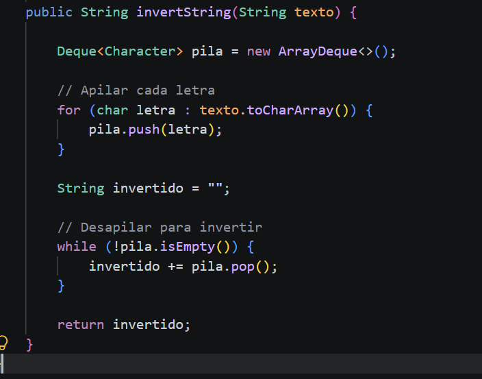
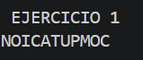
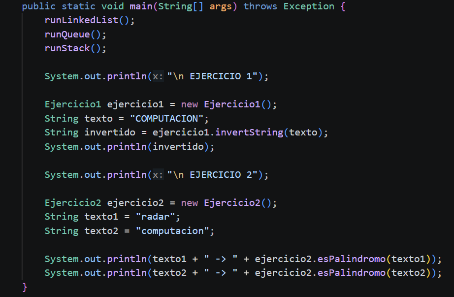
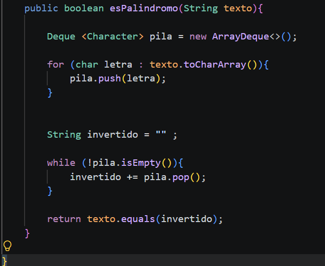

# Práctica: Estructuras Dinámicas Lineales

## Datos del Estudiante
- **Nombre:** [Geovanny Sebastian Pillco Quizhpi]
- **Curso:** [Grupo 3]
- **Fecha:** [09/06/2026]

---

## 1. Implementación de estructuras dinámicas lineales

**Fecha:** [09/06/2026]

**Descripción:**
El primer ejercicio consiste en la inversión de una cadena de texto utilizando exclusivamente el comportamiento LIFO (Last-In, First-Out) de una estructura de pila.

### Método implementado

### Captura de salida en consola

### Captura del código de implementación del ejercicio 1

## 2. Ejercicio Palíndromo

**Fecha:** [09/06/2026]

**Descripción:**
El segundo ejercicio consiste en la verificación de palabras palíndromas aplicando estrictamente la propiedad de reversión conceptual que proveen las pilas.

### Método implementado

